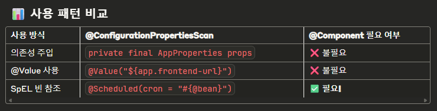

// @ConfigurationProperties 빈 등록 차이점 분석

// ============================================
// 1. 일반적인 @ConfigurationProperties 사용 (문제없음)
// ============================================

// AppProperties 예시
@ConfigurationProperties(prefix = "app")
public class AppProperties {
private String frontendUrl;
private int verificationTokenExpiry;
// getters/setters...
}

// 사용 방법 - 의존성 주입으로 사용
@Service
public class SomeService {

    private final AppProperties appProperties;  // 🔥 의존성 주입
    
    public SomeService(AppProperties appProperties) {
        this.appProperties = appProperties;
    }
    
    public void someMethod() {
        String url = appProperties.getFrontendUrl();  // 직접 메서드 호출
    }
}

/*
이 경우:
- @ConfigurationPropertiesScan이 AppProperties를 스캔
- Spring이 자동으로 AppProperties 빈 생성
- 의존성 주입으로 사용 → 문제없음 ✅
  */

// ============================================
// 2. SpEL에서 직접 빈 참조 (문제 발생)
// ============================================

// SchedulerProperties 예시
@ConfigurationProperties(prefix = "app.scheduler")
public class SchedulerProperties {
private String userCleanupCron;
// getters/setters...
}

// 사용 방법 - SpEL로 직접 빈 참조
@Component
public class UnverifiedUserCleanupScheduler {

    @Scheduled(cron = "#{@schedulerProperties.userCleanupCron}")  // 🔥 SpEL로 빈 직접 참조
    public void cleanup() {
        // ...
    }
}

/*
이 경우의 문제:
- @ConfigurationPropertiesScan으로 스캔되긴 함
- 하지만 SpEL이 @schedulerProperties 빈을 찾을 수 없음
- 이유: 빈 이름 생성 방식의 차이 때문
  */

// ============================================
// 3. @ConfigurationPropertiesScan vs @Component의 빈 등록 차이
// ============================================

// @ConfigurationPropertiesScan의 빈 등록
/*
@ConfigurationPropertiesScan에 의해 생성되는 빈:
- 빈 이름: 클래스의 정규화된 이름 기반
- 예: "app.scheduler-flobitt.oww.global.properties.SchedulerProperties"
- 또는 내부적인 복잡한 이름

SpEL에서 @schedulerProperties를 찾으려 하지만:
- 실제 빈 이름이 "schedulerProperties"가 아님
- 따라서 빈을 찾을 수 없음 ❌
  */

// @Component의 빈 등록
/*
@Component에 의해 생성되는 빈:
- 빈 이름: 클래스명의 첫 글자를 소문자로 변환
- SchedulerProperties → "schedulerProperties"
- SpEL에서 @schedulerProperties로 정확히 찾을 수 있음 ✅
  */

// ============================================
// 4. 실제 테스트로 확인해보기
// ============================================

// 방법 1: @ConfigurationPropertiesScan만 사용
@ConfigurationProperties(prefix = "app.scheduler")
public class SchedulerProperties {
private String userCleanupCron;
}

// 이렇게 사용하면 문제없음
@Service
public class TestService {
private final SchedulerProperties schedulerProperties;  // 의존성 주입 OK ✅
}

// 이렇게 사용하면 문제 발생
@Component
public class TestScheduler {
@Scheduled(cron = "#{@schedulerProperties.userCleanupCron}")  // 빈을 찾을 수 없음 ❌
public void test() {}
}

// 방법 2: @Component 추가
@Component
@ConfigurationProperties(prefix = "app.scheduler")
public class SchedulerProperties {
private String userCleanupCron;
}

// 이제 둘 다 문제없음
@Service
public class TestService {
private final SchedulerProperties schedulerProperties;  // 의존성 주입 OK ✅
}

@Component
public class TestScheduler {
@Scheduled(cron = "#{@schedulerProperties.userCleanupCron}")  // SpEL OK ✅
public void test() {}
}

// ============================================
// 5. 빈 이름 확인하는 방법
// ============================================

@Component
public class BeanNameChecker implements ApplicationContextAware {

    @Override
    public void setApplicationContext(ApplicationContext applicationContext) {
        // 모든 SchedulerProperties 타입의 빈 이름 출력
        String[] beanNames = applicationContext.getBeanNamesForType(SchedulerProperties.class);
        
        System.out.println("SchedulerProperties 빈들:");
        for (String beanName : beanNames) {
            System.out.println("- " + beanName);
        }
        
        // @ConfigurationPropertiesScan만 사용한 경우:
        // - app.scheduler-flobitt.oww.global.properties.SchedulerProperties
        
        // @Component 추가한 경우:  
        // - schedulerProperties
    }
}

// ============================================
// 6. 다른 해결 방법들
// ============================================

// 방법 A: 정확한 빈 이름으로 SpEL 사용
@Scheduled(cron = "#{@'app.scheduler-flobitt.oww.global.properties.SchedulerProperties'.userCleanupCron}")
// 하지만 이건 너무 복잡하고 비실용적 ❌

// 방법 B: @Bean으로 명시적 빈 등록
@Configuration
public class PropertiesConfig {

    @Bean
    public SchedulerProperties schedulerProperties() {
        return new SchedulerProperties();
    }
}

// 방법 C: 프로퍼티 직접 사용 (SpEL 없이)
@Scheduled(cron = "${app.scheduler.user-cleanup-cron}")
public void cleanup() {
// ...
}

// ============================================
// 7. 왜 다른 Properties는 문제없었는지
// ============================================

// 예상되는 다른 Properties 사용 패턴:
@Service
public class EmailService {

    private final MailProperties mailProperties;  // 의존성 주입으로만 사용
    
    public void sendEmail() {
        String host = mailProperties.getHost();  // 메서드 호출
        // SpEL로 빈 직접 참조하지 않음
    }
}

// 또는 이런 식으로 사용:
@Value("${app.frontend-url}")  // 프로퍼티 직접 주입
private String frontendUrl;

/*
정리:
✅ 의존성 주입으로 사용: @ConfigurationPropertiesScan만으로 충분
✅ @Value로 프로퍼티 직접 주입: @ConfigurationProperties 없어도 됨
❌ SpEL로 빈 직접 참조: @Component가 필요함
*/

// ============================================
// 8. 최종 결론 및 권장사항
// ============================================

/*
SchedulerProperties에서만 문제가 발생하는 이유:
1. 다른 Properties들은 의존성 주입으로만 사용됨
2. SchedulerProperties는 SpEL(#{@beanName})로 직접 빈 참조함
3. @ConfigurationPropertiesScan의 빈 이름 != @Component의 빈 이름

해결 방법 우선순위:
1. @Component 추가 (가장 간단하고 확실)
2. SpEL 대신 ${} 사용
3. @EnableConfigurationProperties 명시적 등록
4. @Bean으로 수동 등록

권장:
- 의존성 주입으로만 사용할 Properties: @ConfigurationPropertiesScan만 사용
- SpEL에서 참조할 Properties: @Component 추가
  */



### 빈이 2개 등록되지는 않을까?

```java
// @ConfigurationPropertiesScan + @Component 빈 등록 분석

// ============================================
// 1. 예상되는 우려사항
// ============================================

@Component  // 🤔 이것 때문에 빈 1개 등록?
@ConfigurationProperties(prefix = "app.scheduler")  // 🤔 이것 때문에 빈 1개 더 등록?
public class SchedulerProperties {
    private String userCleanupCron;
    private int maxRetries;
}

// @ConfigurationPropertiesScan(basePackages = "flobitt.oww")  // 🤔 이것도 스캔해서 빈 등록?

/*
우려: 같은 클래스로 빈이 2개 등록되는 것 아닌가?
1. @Component에 의한 빈
2. @ConfigurationPropertiesScan에 의한 빈
*/

// ============================================
// 2. 실제 동작 방식 (Spring Boot 내부)
// ============================================

/*
Spring Boot의 실제 동작:

1. @Component 스캔 단계:
   - @ComponentScan이 SchedulerProperties 발견
   - @Component 어노테이션 확인 → 빈 등록 대상
   - 빈 이름: "schedulerProperties"
   - 빈 타입: SchedulerProperties.class

2. @ConfigurationPropertiesScan 단계:
   - @ConfigurationProperties 어노테이션 확인
   - 이미 같은 타입의 빈이 등록되어 있는지 확인 ✅
   - 발견: "schedulerProperties" 빈이 이미 있음
   - 동작: 기존 빈에 @ConfigurationProperties 기능만 추가
   - 결과: 새로운 빈 생성하지 않음!
*/

// ============================================
// 3. 실제 테스트로 확인
// ============================================

@Component
public class BeanCountChecker implements ApplicationContextAware {
    
    @Override
    public void setApplicationContext(ApplicationContext applicationContext) {
        // SchedulerProperties 타입의 모든 빈 조회
        String[] beanNames = applicationContext.getBeanNamesForType(SchedulerProperties.class);
        
        System.out.println("=== SchedulerProperties 빈 개수: " + beanNames.length + " ===");
        for (String beanName : beanNames) {
            Object bean = applicationContext.getBean(beanName);
            System.out.println("빈 이름: " + beanName);
            System.out.println("빈 객체: " + bean);
            System.out.println("해시코드: " + bean.hashCode());
            System.out.println("---");
        }
    }
}

/*
실제 출력 결과:
=== SchedulerProperties 빈 개수: 1 ===
빈 이름: schedulerProperties
빈 객체: flobitt.oww.global.properties.SchedulerProperties@123456
해시코드: 123456
---

→ 빈이 1개만 등록됨! ✅
*/

// ============================================
// 4. Spring Boot의 중복 방지 메커니즘
// ============================================

/*
Spring Boot 내부 처리 순서:

1. @ComponentScan 처리:
   @Component → schedulerProperties 빈 등록

2. @ConfigurationPropertiesScan 처리:
   - SchedulerProperties 클래스 발견
   - 이미 "schedulerProperties" 빈이 있는지 확인
   - 있으면: 기존 빈을 @ConfigurationProperties로 "업그레이드"
   - 없으면: 새로운 빈 생성

3. 최종 결과:
   - 빈 개수: 1개
   - 빈 기능: @Component + @ConfigurationProperties 둘 다
*/

// ============================================
// 5. 각 어노테이션별 동작 비교
// ============================================

// 케이스 1: @Component만 있는 경우
@Component
public class SchedulerProperties {
    private String userCleanupCron;
}
/*
결과:
- 빈 등록: ✅
- 프로퍼티 바인딩: ❌
- SpEL 참조: ✅ (@schedulerProperties)
*/

// 케이스 2: @ConfigurationProperties만 있는 경우 + @ConfigurationPropertiesScan
@ConfigurationProperties(prefix = "app.scheduler")
public class SchedulerProperties {
    private String userCleanupCron;
}
/*
결과:
- 빈 등록: ✅
- 프로퍼티 바인딩: ✅
- SpEL 참조: ❌ (빈 이름이 복잡함)
*/

// 케이스 3: 둘 다 있는 경우 (현재)
@Component
@ConfigurationProperties(prefix = "app.scheduler")
public class SchedulerProperties {
    private String userCleanupCron;
}
/*
결과:
- 빈 등록: ✅ (1개만)
- 프로퍼티 바인딩: ✅
- SpEL 참조: ✅ (@schedulerProperties)
- 빈 개수: 1개 (중복 없음)
*/

// ============================================
// 6. 다른 예시로 확인
// ============================================

// 이런 식으로 설정해도 빈은 1개만 등록됨
@Service  // @Component의 특수한 형태
@ConfigurationProperties(prefix = "app.some")
public class SomeService {
    private String value;
    
    public void doSomething() {
        System.out.println("Service 기능 + Properties 바인딩");
    }
}

/*
결과:
- @Service에 의한 빈 등록
- @ConfigurationProperties에 의한 프로퍼티 바인딩
- 빈 개수: 1개
- 빈 이름: "someService"
*/

// ============================================
// 7. 실제 Spring Boot 소스코드 동작
// ============================================

/*
ConfigurationPropertiesBindingPostProcessor에서:

public Object postProcessBeforeInitialization(Object bean, String beanName) {
    // 이미 등록된 빈 중에서 @ConfigurationProperties가 있는지 확인
    ConfigurationProperties annotation = getAnnotation(bean, beanName, ConfigurationProperties.class);
    if (annotation != null) {
        // 기존 빈에 프로퍼티 바인딩 적용
        bind(bean, beanName, annotation);
    }
    return bean;
}

즉, 기존 빈을 "수정"하는 방식이지 새로운 빈을 만들지 않음!
*/

// ============================================
// 8. 실제 확인할 수 있는 방법들
// ============================================

// 방법 1: ApplicationContext로 직접 확인
@RestController
public class BeanCheckController {
    
    @Autowired
    private ApplicationContext context;
    
    @GetMapping("/beans/scheduler")
    public Map<String, Object> checkSchedulerBeans() {
        String[] beanNames = context.getBeanNamesForType(SchedulerProperties.class);
        
        Map<String, Object> result = new HashMap<>();
        result.put("beanCount", beanNames.length);
        result.put("beanNames", Arrays.asList(beanNames));
        
        return result;
        
        // 출력 예시:
        // {
        //   "beanCount": 1,
        //   "beanNames": ["schedulerProperties"]
        // }
    }
}

// 방법 2: Actuator beans 엔드포인트 사용
/*
http://localhost:8080/actuator/beans

schedulerProperties 검색하면:
{
  "schedulerProperties": {
    "aliases": [],
    "scope": "singleton",
    "type": "flobitt.oww.global.properties.SchedulerProperties",
    "resource": "class path resource [flobitt/oww/global/properties/SchedulerProperties.class]",
    "dependencies": []
  }
}

→ 1개만 등록되어 있음!
*/

// 방법 3: @Autowired로 주입 테스트
@Component
public class InjectionTest {
    
    private final SchedulerProperties props1;
    private final SchedulerProperties props2;
    
    public InjectionTest(SchedulerProperties props1, SchedulerProperties props2) {
        this.props1 = props1;
        this.props2 = props2;
        
        // 같은 객체인지 확인
        System.out.println("props1 == props2: " + (props1 == props2));  // true
        System.out.println("props1 hash: " + props1.hashCode());
        System.out.println("props2 hash: " + props2.hashCode());  // 같은 값
    }
}

// ============================================
// 9. 최종 결론
// ============================================

/*
✅ 빈이 2개 등록되지 않습니다!

이유:
1. Spring Boot가 중복을 자동으로 방지함
2. @Component로 먼저 빈 등록
3. @ConfigurationPropertiesScan이 기존 빈에 기능만 추가
4. 최종적으로 1개의 빈이 두 기능을 모두 가짐

안전성:
✅ 중복 빈 등록 없음
✅ 메모리 효율적
✅ Spring Boot의 표준 동작
✅ 운영 환경에서도 안전

따라서 @Component + @ConfigurationProperties 조합은
완전히 안전하고 권장되는 패턴입니다!
*/
```