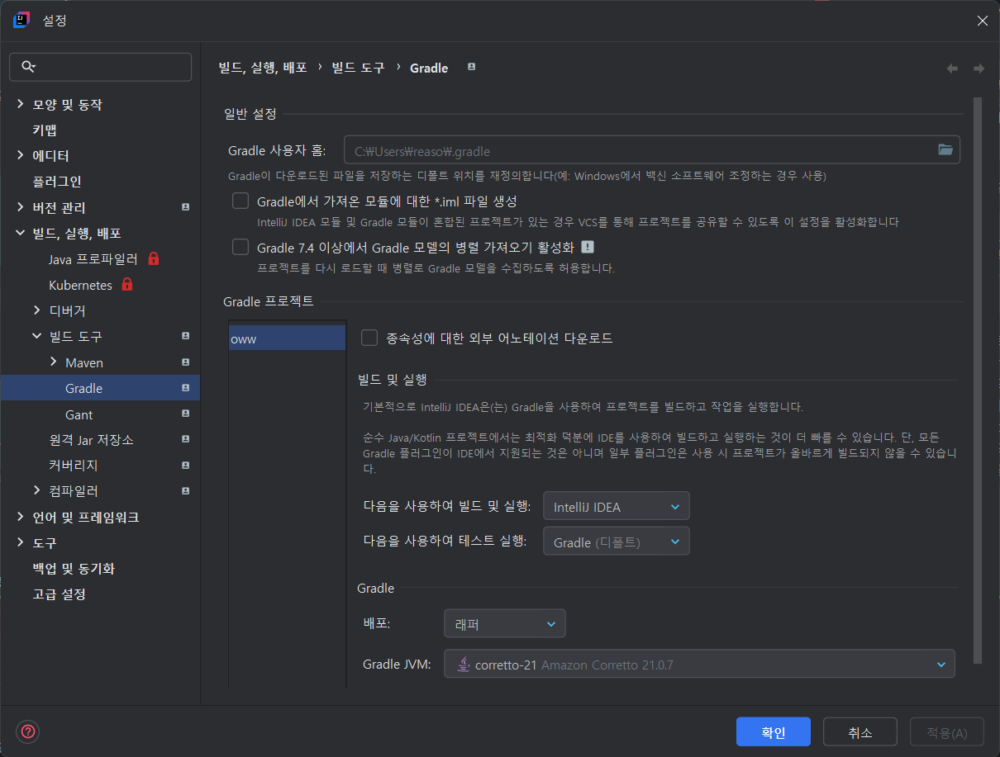

### 경고 메세지
```java
Mockito is currently self-attaching to enable the inline-mock-maker. This will no longer work in future releases of the JDK. Please add Mockito as an agent to your build as described in Mockito's documentation: https://javadoc.io/doc/org.mockito/mockito-core/latest/org.mockito/org/mockito/Mockito.html#0.3
WARNING: A Java agent has been loaded dynamically (C:\Users\reaso\.gradle\caches\modules-2\files-2.1\net.bytebuddy\byte-buddy-agent\1.17.6\17b32fd9f57deef02842f7f05abc4ad8127fe34e\byte-buddy-agent-1.17.6.jar)
WARNING: If a serviceability tool is in use, please run with -XX:+EnableDynamicAgentLoading to hide this warning
WARNING: If a serviceability tool is not in use, please run with -Djdk.instrument.traceUsage for more information
WARNING: Dynamic loading of agents will be disallowed by default in a future release
OpenJDK 64-Bit Server VM warning: Sharing is only supported for boot loader classes because bootstrap classpath has been appended
```
내용:
- Mockito가 JDK 21 이상에서 dynamic agent loading을 사용할 때 발생하는 것
  - Dynamic Agent Loading이란?
    - Agent는 JVM에서 실행되는 프로그램을 런타임 중에 수정할 수 있는 도구
        ```java
        // 예시: 원래 코드
        public class Calculator {
            public int add(int a, int b) {
                return a + b;
            }
        }
        
        // Agent가 런타임 중에 이 코드를 이렇게 바꿀 수 있음
        public class Calculator {
            public int add(int a, int b) {
                System.out.println("add 메서드 호출됨!"); // 로그 추가
                return a + b;
            }
        }
        ```
    - Dynamic Agent Loading은 프로그램이 실행 중일 때 이런 Agent를 동적으로 붙이는 것
  - Mockito가 왜 Agent를 사용하나?
    - Mockito는 mock 객체를 만들 때 클래스를 조작해야 함
        ```java
        @Mock
        private UserRepository userRepository;
        
        // Mockito가 내부적으로 하는 일:
        // 1. UserRepository 클래스를 분석
        // 2. 가짜 구현체를 만들어서
        // 3. 진짜 메서드 대신 가짜 메서드가 호출되도록 조작
        ```
    - 이 과정에서 바이트코드 조작이 필요한데, 이때 Agent를 사용
- 미래 JDK 버전에서는 이런 방식이 지원되지 않을 예정이라는 안내

### 해결 방법
1. 가장 간단한 해결책: JVM 옵션 추가
   - 테스트 실행 시 JVM 옵션을 추가하여 경고를 숨길 수 있습니다.
   - Gradle 사용 시 build.gradle에 추가:
        ```java
        test {
            jvmArgs '-XX:+EnableDynamicAgentLoading'
            useJUnitPlatform()
        }
        ```
     - -XX:+EnableDynamicAgentLoading 옵션은 JVM에게 "알겠어, 그래도 지금은 동적 Agent 로딩 허용해줘. 경고도 그만해."라고 말하는 것

2. Mockito를 Java Agent로 설정 (권장) + 
   - 더 근본적인 해결책으로, Mockito를 Java Agent로 설정할 수 있음
   - Gradle 사용 시:
       ```java
       test {
           jvmArgs "-javaagent:${configurations.testRuntimeClasspath.find { it.name.contains('mockito-core') }}", '-Xshare:off'
           useJUnitPlatform()
       }
       ```
     - IntelliJ인 경우, 테스트 도구를 Gradle로 해야 적용
   - "Mockito를 Java Agent로 설정"한다는 것?
     - 현재 방식 (Dynamic Loading):
        ```java
        1. 테스트 시작
        2. Mockito: "어? Mock 필요하네, 지금 Agent 붙여야겠다"
        3. JVM에 Agent 동적으로 붙임
        4. 경고 발생 ⚠️
        ```
     - Agent로 설정하는 방식:
       ```java
       1. JVM 시작할 때부터 Mockito Agent를 미리 붙여놓음
       2. 테스트 시작
       3. Mockito: "Agent 이미 준비되어 있네!"
       4. 경고 없음 ✅
       ```
     - 실제 비유로 설명하면:
       - Dynamic Loading (현재):
         - 요리하다가 "어? 칼이 없네" → 급하게 칼 빌리러 가기
         - 매번 필요할 때마다 빌리러 가야 함
       - Agent로 미리 설정:
         - 요리 시작 전에 미리 모든 도구 준비해놓기
         - 필요할 때 바로 사용
    - 현재 방식 (Dynamic Loading) 상세 분석
      1. 테스트 시작
         ```java
          @Test
          void createUser_Success() {
          // given
          User user = createTestUser("test@example.com", "testuser");
          given(userRepository.save(any(User.class))).willReturn(user); // 👈 여기!
          ```
      2. Mockito: "어? Mock 필요하네, 지금 Agent 붙여야겠다"
         ```java
         @Mock
         private UserRepository userRepository; // 👈 이 Mock을 실제로 사용하려는 순간!
         ```
         - Mockito 내부 생각:
           - "UserRepository를 Mock으로 만들어야 하는데..."
           - "이 인터페이스의 save() 메서드를 가짜로 만들어야 해"
           - "그런데 이걸 하려면 바이트코드 조작이 필요하다"
           - "바이트코드 조작하려면 Agent가 필요해!"
      3. JVM에 Agent 동적으로 붙임
            ```java
            // Mockito가 내부적으로 하는 일 (의사코드)
            if (!isAgentAttached()) {
                // 긴급하게 Agent 붙이기!
                attachAgent(ByteBuddyAgent.class);
            }
            ```
         - 실제 일어나는 과정:
           - byte-buddy-agent-1.17.6.jar 파일을 찾음
           - JVM의 Instrumentation API를 사용해서 Agent 붙임
           - 이제 클래스 변형 가능!
      4. 경고 발생 ⚠️
          ```
          WARNING: A Java agent has been loaded dynamically
          WARNING: Dynamic loading of agents will be disallowed by default in a future release
          ```
         - JDK의 불만:
           - "어? 프로그램 실행 중에 Agent가 붙었네?"
           - "이거 보안상 위험할 수 있어!"
           - "미래에는 이런 거 못하게 할 거야!"
    - Agent로 설정하는 방식 상세 분석
        1. JVM 시작할 때부터 Mockito Agent를 미리 붙여놓음
            ```bash
            # JVM 시작할 때 이렇게 실행됨:
            java -javaagent:mockito-core-5.8.0.jar MyTest
            ```
           
            - JVM 시작 순서:
              1. JVM 부팅
              2. "아, Agent 붙이라고 했네" → Mockito Agent 즉시 로드
              3. 클래스 변형 준비 완료 ✅
              4. 애플리케이션 시작
   
        2. 테스트 시작
            ```java
            @Test
            void createUser_Success() {
            // given
                User user = createTestUser("test@example.com", "testuser");
                given(userRepository.save(any(User.class))).willReturn(user);
            ```

        3. Mockito: "Agent 이미 준비되어 있네!"
            ```java
            // Mockito 내부 생각:
            if (isAgentAttached()) {
            // "좋아! Agent 이미 준비됐으니까 바로 Mock 만들자!"
                createMock(UserRepository.class);
            }
            ```
            - 차이점:
                - **현재 방식**: Mock 필요할 때마다 "Agent 있나?" 체크 → 없으면 붙이기
                - **미리 설정**: 이미 Agent 준비되어 있으니 바로 사용

        4. 경고 없음 ✅

        5. JDK 입장에서는:
            - "Agent가 처음부터 있었네? 그럼 괜찮아!"
            - "동적으로 붙인 게 아니라 시작할 때부터 있었으니까"

    -  실제 타이밍 비교
      - Dynamic Loading 타이밍:
        ```
        0ms: JVM 시작
        50ms: 테스트 클래스 로드
        100ms: @Test 메서드 실행
        150ms: given(userRepository.save()) 호출
        151ms: "어? Mock 필요해! Agent 붙여야 해!"
        200ms: Agent 동적으로 붙임 (경고 발생)
        250ms: Mock 객체 생성
        300ms: 테스트 실행
        ```
      - Agent 미리 설정 타이밍:
        ```
        0ms: JVM 시작
        1ms: Agent 미리 붙임 (경고 없음)
        50ms: 테스트 클래스 로드
        100ms: @Test 메서드 실행
        150ms: given(userRepository.save()) 호출
        151ms: "Agent 이미 있네! 바로 사용하자"
        160ms: Mock 객체 생성
        200ms: 테스트 실행
        ```
      -  왜 JDK가 Dynamic Loading을 싫어하나?
            ```java
            
            // 악의적인 코드가 이런 식으로 할 수 있음:
            public class MaliciousCode {
                public void hackSystem() {
            // 실행 중에 Agent 붙여서// 시스템 보안 관련 클래스들 조작
                    attachAgent(EvilAgent.class);
                }
            }
            ```
            - JDK의 입장:
                - "처음부터 Agent 있는 건 허용해줄게 (개발자가 의도한 거니까)"
                - "하지만 실행 중에 갑자기 붙이는 건 위험해!"
                - 그래서 미래에는 dynamic loading을 막으려는 거죠!

3. IDE 설정(IntelliJ)
   - Run Configuration에서 VM options에 -XX:+EnableDynamicAgentLoading 추가
   - 또는 Help → Edit Custom VM Options에서 전역 설정

4. 대안: @MockitoSettings 사용
   - 테스트 클래스에 다음 어노테이션을 추가하여 inline mock maker를 명시적으로 비활성화할 수 있음
    ```java
    @ExtendWith(MockitoExtension.class)
    @MockitoSettings(strictness = Strictness.LENIENT)
    class UserServiceTest {
    // 기존 코드...
    }
    ```
   

